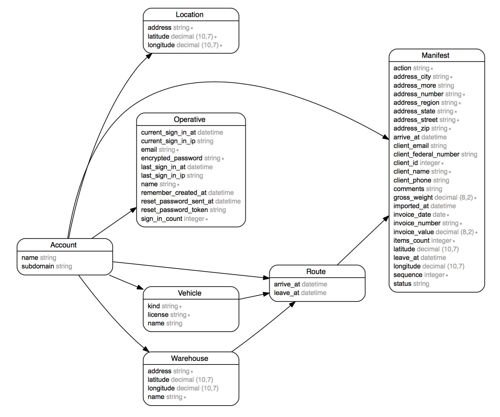

# Introdução

Bem-vindo à API do Roadtrack! Você pode usar nossa API para acessar os endpoints com informações sobre Rotas, Manifestos, Contas e diversas outras entidades que compõe o sistema Roadtrack. 

A API REST permite acesso fácil por sistemas e linguagens que entendam JSON.

Cada entidade da API possui um identificador `href`, que é o endereço do seu endpoint. Desta forma, cada resposta possui o caminho para as próximas requisições, tornando o sistema fácil de navegar.

Além de `GET`, os endpoints aceitam os outros verbos HTTP para suas operações. `POST` para a criação de novas entidades, `PUT` para a edição e `DELETE` para a exclusão. Estas operações estão subordinadas às permissões de acesso do usuário logado.

## Modelo de Entidade-Relacionamento do Sistema



# Autenticação

A autenticação é feita através de um cabeçalho `Authorization` a ser enviado a cada requisição. Este cabeçalho deve conter um token de autenticação que o usuário recebe após fazer (login)[#login], da seguinte forma:


<aside class="notice">
Substitua <code>{token}</code> pelo token recebido ao fazer login.
</aside>

<aside class="warning">
O token tem um tempo de vida curto. Se ele for expirado durante o uso da API, faça login novamente para obter outro.
</aside>


```shell
curl "/api/v1/{endpoint}"
  -H "Authorization: {token}"
```

## Login

O login dá acesso ao usuário às outras funcionalidades do sistema. Deve ser feito sempre que o token de acesso expirar.

### HTTPS Request
`POST https://api.roadtrack.com.br/v1/login`

### Parâmetros da URL

Parâmetro | Descrição
--------- | -----------
email | O email do usuário
password | A senha do usuário

### Resposta

Parâmetro | Descrição
--------- | -----------
account | A referência para a conta à qual o usuário pertence
user | O usuário autenticado
token | O token de autenticação


```shell
curl "https://api.roadtrack.com.br/v1/login"
  -X POST
  -F "email={email}"
  -F "password={password}"
```

> O comando acima retorna:

```json
{
  "account": "https://api.roadtrack.com.br/v1/account/1",
  "user": "https://api.roadtrack.com.br/v1/user/1",
  "token": "1G8_s7P-V-4MGojaKD7a"
}
```

# Conta

`Account` é o obejto que representa a conta à qual o usuário autenticado está subordinado. Todas as informações passíveis de ser acessadas, como Rotas e Manifestos, são referentes à ela.

### HTTPS request

`GET https://api.roadtrack.com.br/v1/account`

```shell
curl "https://api.roadtrack.com.br/v1/account"
  -H "Authorization: token"
```

> O comando acima retorna:

```json
{
  "href": "https://api.roadtrack.com.br/v1/account/1",
  "name": "Ramada",
  "subdomain": "ramada",
  "created_at": "2016-04-10T10:20:26.412Z",
  "updated_at": "2016-04-10T10:20:26.412Z"
}
```

# Veículo

'Vehicle' é o objeto que representa os diversos tipos de veículos utilizados nas rotas para cumprir os manifestos.

## Todos os Veículos

```shell
curl "https://api.roadtrack.com.br/v1/vehicle"
  -H "Authorization: token"
```

> O comando acima retorna:

```json
[
  {
    "href": "https://api.roadtrack.com.br/v1/vehicle/18",
    "name": null,
    "license": "KZY7142",
    "kind": "CAMINHÃO",
    "created_at": "2016-04-10T10:20:26.498Z",
    "updated_at": "2016-04-10T10:20:26.498Z",
    "account": "https://api.roadtrack.com.br/v1/route/account/1"
  },
  {
    "href": "https://api.roadtrack.com.br/v1/vehicle/19",
    "name": null,
    "license": "LLN3357",
    "kind": "KOMBI",
    "created_at": "2016-04-10T10:20:26.499Z",
    "updated_at": "2016-04-10T10:20:26.499Z",
    "account": "https://api.roadtrack.com.br/v1/route/account/1"
  },
  {
    "href": "https://api.roadtrack.com.br/v1/vehicle/20",
    "name": null,
    "license": "KPO2180",
    "kind": "MOTO",
    "created_at": "2016-04-10T10:20:26.501Z",
    "updated_at": "2016-04-10T10:20:26.501Z",
    "account": "https://api.roadtrack.com.br/v1/route/account/1"
  }
]
```

## Um Veículo

```shell
curl "https://api.roadtrack.com.br/v1/vehicle/{id}"
  -H "Authorization: token"
```

```json
{
  "href": "https://api.roadtrack.com.br/v1/vehicle/18",
  "name": null,
  "license": "KZY7142",
  "kind": "CAMINHÃO",
  "created_at": "2016-04-10T10:20:26.498Z",
  "updated_at": "2016-04-10T10:20:26.498Z",
  "account_id": 1,
  "routes": [
    {
      "href": "https://api.roadtrack.com.br/v1/route/13102",
      "created_at": "2016-04-10T10:20:26.571Z",
      "updated_at": "2016-06-21T18:47:02.287Z",
      "leave_at": "2016-06-21T10:20:00.000Z",
      "arrive_at": null,
      "vehicle": "https://api.roadtrack.com.br/v1/route/vehicle/1",
      "warehouse": "https://api.roadtrack.com.br/v1/route/warehouse/1",
      "account": "https://api.roadtrack.com.br/v1/route/account/1"
    },
    {
      "href": "https://api.roadtrack.com.br/v1/route/13103",
      "created_at": "2016-04-10T10:20:26.576Z",
      "updated_at": "2016-04-10T10:20:26.576Z",
      "leave_at": "2016-04-10T10:20:26.575Z",
      "arrive_at": null,
      "vehicle": "https://api.roadtrack.com.br/v1/route/vehicle/1",
      "warehouse": "https://api.roadtrack.com.br/v1/route/warehouse/1",
      "account": "https://api.roadtrack.com.br/v1/route/account/1"
    },
    {
      "href": "https://api.roadtrack.com.br/v1/route/13104",
      "created_at": "2016-04-10T10:20:26.581Z",
      "updated_at": "2016-04-10T10:20:26.581Z",
      "leave_at": "2016-04-10T10:20:26.579Z",
      "arrive_at": null,
      "vehicle": "https://api.roadtrack.com.br/v1/route/vehicle/1",
      "warehouse": "https://api.roadtrack.com.br/v1/route/warehouse/2",
      "account": "https://api.roadtrack.com.br/v1/route/account/1"
    }
  ]
}
```

# Centros de Distribuição

`Warehouse` é o nome do objeto que representa um Centro de Distribuição no sistema. Ele é o ponto de partida e o ponto de chegada de uma Rota.

## Todos os Centros de Distribuição

```shell
curl "https://api.roadtrack.com.br/v1/warehouse"
  -H "Authorization: token"
```

> O comando acima retorna:

```json
[
  {
    "href": "https://api.roadtrack.com.br/v1/warehouse/1",
    "name": "RAMADA CD 01",
    "address": "Rua Pedro Jorio 365 - Rio de Janeiro, RJ - 21530-030 ",
    "latitude": -22.826978,
    "longitude": -43.354807,
    "created_at": "2016-04-10T10:20:26.443Z",
    "updated_at": "2016-04-10T10:20:26.443Z"
  },
  {
    "href": "https://api.roadtrack.com.br/v1/warehouse/2",
    "name": "RAMADA CD 02",
    "address": "Rua dos Diamantes 388 - Rio de Janeiro, RJ - 21510-003",
    "latitude": null,
    "longitude": null,
    "created_at": "2016-04-10T10:20:26.447Z",
    "updated_at": "2016-04-10T10:20:26.447Z"
  }
]
```

## Um Centro de Distribuição

```shell
curl "https://api.roadtrack.com.br/v1/warehouse/{id}"
  -H "Authorization: token"
```

> Ocomando acima retorna:

```json
{
  "href": "https://api.roadtrack.com.br/v1/warehouse/1",
  "name": "RAMADA CD 01",
  "address": "Rua Pedro Jorio 365 - Rio de Janeiro, RJ - 21530-030 ",
  "latitude": -22.826978,
  "longitude": -43.354807,
  "created_at": "2016-04-10T10:20:26.443Z",
  "updated_at": "2016-04-10T10:20:26.443Z",
  "routes": [
    {
      "href": "https://api.roadtrack.com.br/v1/route/13102",
      "created_at": "2016-04-10T10:20:26.571Z",
      "updated_at": "2016-06-21T18:47:02.287Z",
      "leave_at": "2016-06-21T10:20:00.000Z",
      "arrive_at": null,
      "vehicle": "https://api.roadtrack.com.br/v1/route/vehicle/1",
      "warehouse": "https://api.roadtrack.com.br/v1/route/warehouse/1",
      "account": "https://api.roadtrack.com.br/v1/route/account/1"
    },
    {
      "href": "https://api.roadtrack.com.br/v1/route/13103",
      "created_at": "2016-04-10T10:20:26.576Z",
      "updated_at": "2016-04-10T10:20:26.576Z",
      "leave_at": "2016-04-10T10:20:26.575Z",
      "arrive_at": null,
      "vehicle": "https://api.roadtrack.com.br/v1/route/vehicle/1",
      "warehouse": "https://api.roadtrack.com.br/v1/route/warehouse/1",
      "account": "https://api.roadtrack.com.br/v1/route/account/1"
    },
    {
      "href": "https://api.roadtrack.com.br/v1/route/13104",
      "created_at": "2016-04-10T10:20:26.581Z",
      "updated_at": "2016-04-10T10:20:26.581Z",
      "leave_at": "2016-04-10T10:20:26.579Z",
      "arrive_at": null,
      "vehicle": "https://api.roadtrack.com.br/v1/route/vehicle/1",
      "warehouse": "https://api.roadtrack.com.br/v1/route/warehouse/2",
      "account": "https://api.roadtrack.com.br/v1/route/account/1"
    }
  ]
}
```

# Rota

`Route` é o objeto que representa uma Rota. A Rota é composta por um Centro de Distribuição, um Veículo e diversos Manifestos.

## Todas as Rotas

```shell
curl "https://api.roadtrack.com.br/v1/route"
  -H "Authorization: token"
```

> Ocomando acima retorna:

```json
[
  {
    "href": "https://api.roadtrack.com.br/v1/route/13103",
    "created_at": "2016-04-10T10:20:26.576Z",
    "updated_at": "2016-04-10T10:20:26.576Z",
    "leave_at": "2016-04-10T10:20:26.575Z",
    "arrive_at": null,
    "vehicle": "https://api.roadtrack.com.br/v1/route/vehicle/1",
    "warehouse": "https://api.roadtrack.com.br/v1/route/warehouse/1",
    "account": "https://api.roadtrack.com.br/v1/route/account/1"
  },
  {
    "href": "https://api.roadtrack.com.br/v1/route/13104",
    "created_at": "2016-04-10T10:20:26.581Z",
    "updated_at": "2016-04-10T10:20:26.581Z",
    "leave_at": "2016-04-10T10:20:26.579Z",
    "arrive_at": null,
    "vehicle": "https://api.roadtrack.com.br/v1/route/vehicle/1",
    "warehouse": "https://api.roadtrack.com.br/v1/route/warehouse/2",
    "account": "https://api.roadtrack.com.br/v1/route/account/1"
  },
  {
    "href": "https://api.roadtrack.com.br/v1/route/13102",
    "created_at": "2016-04-10T10:20:26.571Z",
    "updated_at": "2016-06-21T18:47:02.287Z",
    "leave_at": "2016-06-21T10:20:00.000Z",
    "arrive_at": null,
    "vehicle": "https://api.roadtrack.com.br/v1/route/vehicle/1",
    "warehouse": "https://api.roadtrack.com.br/v1/route/warehouse/1",
    "account": "https://api.roadtrack.com.br/v1/route/account/1"
  }
]
```

## Uma Rota

```shell
curl "https://api.roadtrack.com.br/v1/route/{id}"
  -H "Authorization: token"
```

> Ocomando acima retorna:

```json
{
  "href": "https://api.roadtrack.com.br/v1/route/13103",
  "created_at": "2016-04-10T10:20:26.576Z",
  "updated_at": "2016-04-10T10:20:26.576Z",
  "leave_at": "2016-04-10T10:20:26.575Z",
  "arrive_at": null,
  "vehicle": "https://api.roadtrack.com.br/v1/route/vehicle/1",
  "warehouse": "https://api.roadtrack.com.br/v1/route/warehouse/1",
  "account": "https://api.roadtrack.com.br/v1/route/account/1",
  "manifests": [
    {
      "href": "https://api.roadtrack.com.br/v1/manifest/1",
      "action": "E",
      "invoice_number": "323996",
      "invoice_date": "2014-12-03",
      "invoice_value": 941.21,
      "sequence": 40,
      "items_count": 8,
      "gross_weight": 1,
      "client_name": "# ROSHELAR MAT. ELETR. HIDR.LTDA(M.E)",
      "client_id": 2607,
      "client_phone": "2134641468",
      "client_federal_number": "4065336000193",
      "client_email": "marcio777@gmail.com",
      "address_street": "DO GOVERNO",
      "address_number": "1067",
      "address_more": "",
      "address_zip": "21770100",
      "address_region": "CAMPO GRANDE ",
      "address_city": "RIO DE JANEIRO",
      "address_state": "RJ",
      "latitude": -22.90856,
      "longitude": -43.176935,
      "comments": "TESTANDO CARGA DE DADOS",
      "status": "initial",
      "arrive_at": null,
      "leave_at": null,
      "created_at": "2016-04-10T10:20:26.609Z",
      "updated_at": "2016-04-10T10:20:26.609Z",
      "imported_at": null,
      "account": "https://api.roadtrack.com.br/v1/account/1",
      "route": "https://api.roadtrack.com.br/v1/route/13102"
    },
    {
      "href": "https://api.roadtrack.com.br/v1/manifest/7",
      "action": "E",
      "invoice_number": "324024",
      "invoice_date": "2014-12-03",
      "invoice_value": 1089.92,
      "sequence": 60,
      "items_count": 6,
      "gross_weight": 1,
      "client_name": "BAZAR SAO DOMINGOS DE BANGU LTDA ME",
      "client_id": 46305,
      "client_phone": "00213331 8662",
      "client_federal_number": "4080423000110",
      "client_email": "marcio777@gmail.com",
      "address_street": "CEL. TAMARINDO",
      "address_number": "SN",
      "address_more": "LOJA C PLAT EST BANGU",
      "address_zip": "21840440",
      "address_region": "CAMPO GRANDE ",
      "address_city": "RIO DE JANEIRO",
      "address_state": "RJ",
      "latitude": -22.96354,
      "longitude": -43.348961,
      "comments": "TESTANDO CARGA DE DADOS",
      "status": "initial",
      "arrive_at": null,
      "leave_at": null,
      "created_at": "2016-04-10T10:20:26.638Z",
      "updated_at": "2016-04-10T10:20:26.638Z",
      "imported_at": null,
      "account": "https://api.roadtrack.com.br/v1/account/1",
      "route": "https://api.roadtrack.com.br/v1/route/13102"
    },
    {
      "href": "https://api.roadtrack.com.br/v1/manifest/8",
      "action": "E",
      "invoice_number": "324025",
      "invoice_date": "2014-12-03",
      "invoice_value": 219.77,
      "sequence": 100,
      "items_count": 5,
      "gross_weight": 1,
      "client_name": "GGJ BZ.E MATERIAIS DE CONSTRUCAO LTDA.",
      "client_id": 1513,
      "client_phone": "2124128396",
      "client_federal_number": "7649256000173",
      "client_email": "marcio777@gmail.com",
      "address_street": "ARY LOBO",
      "address_number": "SN",
      "address_more": "LOTE 31 QUADRA 37",
      "address_zip": "23088120",
      "address_region": "CAMPO GRANDE ",
      "address_city": "RIO DE JANEIRO",
      "address_state": "RJ",
      "latitude": -23.012213,
      "longitude": -43.433418,
      "comments": "TESTANDO CARGA DE DADOS",
      "status": "initial",
      "arrive_at": null,
      "leave_at": null,
      "created_at": "2016-04-10T10:20:26.643Z",
      "updated_at": "2016-04-10T10:20:26.643Z",
      "imported_at": null,
      "account": "https://api.roadtrack.com.br/v1/account/1",
      "route": "https://api.roadtrack.com.br/v1/route/13102"
    }
  ]
}
```

# Manifesto

`Manifest` é o objeto que representa os Manifestos. Cada manifesto contém informações sobre o cliente o tipo de serviço que vai ser feito, assim como as datas de chegada, saída e o status da operação.

## Todos os Manifestos

```shell
curl "https://api.roadtrack.com.br/v1/manifest"
  -H "Authorization: token"
```

> Ocomando acima retorna:

```json
[
  {
    "href": "https://api.roadtrack.com.br/v1/manifest/1",
    "action": "E",
    "invoice_number": "323996",
    "invoice_date": "2014-12-03",
    "invoice_value": 941.21,
    "sequence": 40,
    "items_count": 8,
    "gross_weight": 1,
    "client_name": "# ROSHELAR MAT. ELETR. HIDR.LTDA(M.E)",
    "client_id": 2607,
    "client_phone": "2134641468",
    "client_federal_number": "4065336000193",
    "client_email": "marcio777@gmail.com",
    "address_street": "DO GOVERNO",
    "address_number": "1067",
    "address_more": "",
    "address_zip": "21770100",
    "address_region": "CAMPO GRANDE ",
    "address_city": "RIO DE JANEIRO",
    "address_state": "RJ",
    "latitude": -22.90856,
    "longitude": -43.176935,
    "comments": "TESTANDO CARGA DE DADOS",
    "status": "initial",
    "arrive_at": null,
    "leave_at": null,
    "created_at": "2016-04-10T10:20:26.609Z",
    "updated_at": "2016-04-10T10:20:26.609Z",
    "imported_at": null,
    "account": "https://api.roadtrack.com.br/v1/account/1",
    "route": "https://api.roadtrack.com.br/v1/route/13102"
  },
  {
    "href": "https://api.roadtrack.com.br/v1/manifest/7",
    "action": "E",
    "invoice_number": "324024",
    "invoice_date": "2014-12-03",
    "invoice_value": 1089.92,
    "sequence": 60,
    "items_count": 6,
    "gross_weight": 1,
    "client_name": "BAZAR SAO DOMINGOS DE BANGU LTDA ME",
    "client_id": 46305,
    "client_phone": "00213331 8662",
    "client_federal_number": "4080423000110",
    "client_email": "marcio777@gmail.com",
    "address_street": "CEL. TAMARINDO",
    "address_number": "SN",
    "address_more": "LOJA C PLAT EST BANGU",
    "address_zip": "21840440",
    "address_region": "CAMPO GRANDE ",
    "address_city": "RIO DE JANEIRO",
    "address_state": "RJ",
    "latitude": -22.96354,
    "longitude": -43.348961,
    "comments": "TESTANDO CARGA DE DADOS",
    "status": "initial",
    "arrive_at": null,
    "leave_at": null,
    "created_at": "2016-04-10T10:20:26.638Z",
    "updated_at": "2016-04-10T10:20:26.638Z",
    "imported_at": null,
    "account": "https://api.roadtrack.com.br/v1/account/1",
    "route": "https://api.roadtrack.com.br/v1/route/13102"
  },
  {
    "href": "https://api.roadtrack.com.br/v1/manifest/8",
    "action": "E",
    "invoice_number": "324025",
    "invoice_date": "2014-12-03",
    "invoice_value": 219.77,
    "sequence": 100,
    "items_count": 5,
    "gross_weight": 1,
    "client_name": "GGJ BZ.E MATERIAIS DE CONSTRUCAO LTDA.",
    "client_id": 1513,
    "client_phone": "2124128396",
    "client_federal_number": "7649256000173",
    "client_email": "marcio777@gmail.com",
    "address_street": "ARY LOBO",
    "address_number": "SN",
    "address_more": "LOTE 31 QUADRA 37",
    "address_zip": "23088120",
    "address_region": "CAMPO GRANDE ",
    "address_city": "RIO DE JANEIRO",
    "address_state": "RJ",
    "latitude": -23.012213,
    "longitude": -43.433418,
    "comments": "TESTANDO CARGA DE DADOS",
    "status": "initial",
    "arrive_at": null,
    "leave_at": null,
    "created_at": "2016-04-10T10:20:26.643Z",
    "updated_at": "2016-04-10T10:20:26.643Z",
    "imported_at": null,
    "account": "https://api.roadtrack.com.br/v1/account/1",
    "route": "https://api.roadtrack.com.br/v1/route/13102"
  }
]
```

## Um Manifesto

```shell
curl "https://api.roadtrack.com.br/v1/manifest/{id}"
  -H "Authorization: token"
```

> Ocomando acima retorna:

```json
{
  "href": "https://api.roadtrack.com.br/v1/manifest/8",
  "action": "E",
  "invoice_number": "324025",
  "invoice_date": "2014-12-03",
  "invoice_value": 219.77,
  "sequence": 100,
  "items_count": 5,
  "gross_weight": 1,
  "client_name": "GGJ BZ.E MATERIAIS DE CONSTRUCAO LTDA.",
  "client_id": 1513,
  "client_phone": "2124128396",
  "client_federal_number": "7649256000173",
  "client_email": "marcio777@gmail.com",
  "address_street": "ARY LOBO",
  "address_number": "SN",
  "address_more": "LOTE 31 QUADRA 37",
  "address_zip": "23088120",
  "address_region": "CAMPO GRANDE ",
  "address_city": "RIO DE JANEIRO",
  "address_state": "RJ",
  "latitude": -23.012213,
  "longitude": -43.433418,
  "comments": "TESTANDO CARGA DE DADOS",
  "status": "initial",
  "arrive_at": null,
  "leave_at": null,
  "created_at": "2016-04-10T10:20:26.643Z",
  "updated_at": "2016-04-10T10:20:26.643Z",
  "imported_at": null,
  "account": "https://api.roadtrack.com.br/v1/account/1",
  "route": "https://api.roadtrack.com.br/v1/route/13102"
}
```
