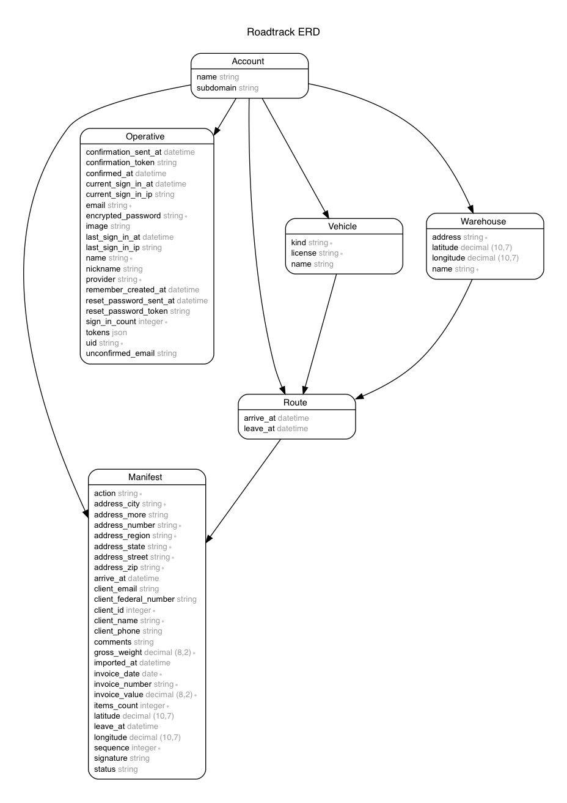

# Introdução

Bem-vindo à API do Roadtrack! Você pode usar nossa API para acessar os endpoints com informações sobre Rotas, Manifestos, Contas e diversas outras entidades que compõe o sistema Roadtrack.

A API REST permite acesso fácil por sistemas e linguagens que entendam JSON.

Cada entidade da API possui um identificador `href`, que é o endereço do seu endpoint. Desta forma, cada resposta possui o caminho para as próximas requisições, tornando o sistema fácil de navegar.

Além de `GET`, os endpoints aceitam os outros verbos HTTP para suas operações. `POST` para a criação de novas entidades, `PUT` para a edição e `DELETE` para a exclusão. Estas operações estão subordinadas às permissões de acesso do usuário logado.

## Modelo de Entidade-Relacionamento do Sistema



# Autenticação

A autenticação é feita através do envio de cabeçalhos  específicos a cada requisição. Estes cabeçalhos devem conter dados de autenticação que o usuário recebe após fazer <a href="#login">login</a>, da seguinte forma:


```shell
curl "/api/v1/{endpoint}"
  -H "access-token: {access-token}"
  -H "uid: {uid}"
  -H "client: {client}"
```

Os valores de `access-token`, `uid` e `client` expiram geralmente após um único uso, de forma que é necessário que se use valores novos a cada nova requisição. Felizmente cada retorno da API traz em seus cabeçalhos novos valores para autenticação da próxima requisição.

A recomendação para uso aqui é ter algum tipo de objeto global que contenha esses três valores e que seja atualizado a cada resposta da api e utlizado na próxima requisição, de forma que não seja necessário fazer login constantemente.

## Login

O Login dá acesso ao usuário às outras funcionalidades do sistema. Deve ser feito sempre que o token de acesso expirar.

### HTTPS Request
`POST https://api.roadtrack.com.br/v1/user/login`

### Parâmetros da URL

Parâmetro | Descrição
--------- | ---------
email     | O email do usuário
password  | A senha do usuário

### Resposta

Parâmetro | Descrição
--------- | ---------
operative | Informações do usuário autenticado

## Cabeçalhos

Cabeçalho    | Descrição
------------ | ---------
access-token | O token de acesso
token-type   | O tipo do token, usualmente "Bearer"
client       | Identificador do cliente
expiry       | Timestamp de expiração do token
uid          | Identificador único do usuário


```shell
curl "https://api.roadtrack.com.br/v1/user/login"
  -X POST
  -F "email={email}"
  -F "password={password}"
```

> O comando acima retorna:

```json
{
  "operative": {
    "href": "http://api.roadtrack.com.br/v1/user/1",
    "created_at": "2016-09-07T00:11:55.143Z",
    "updated_at": "2017-03-19T15:33:07.701Z",
    "id": 1,
    "name": "John Appleseed",
    "nickname": "John",
    "image": null,
    "email": "user@test.com",
    "account": {
      "href": "http://api.roadtrack.com.br/v1/account/1",
      "id": 1
    }
  }
}
```

# Conta

`Account` é o obejto que representa a conta à qual o usuário autenticado está subordinado. Todas as informações passíveis de ser acessadas, como Rotas e Manifestos, são referentes à ela.

### HTTPS request

`GET https://api.roadtrack.com.br/v1/account`

```shell
curl "https://api.roadtrack.com.br/v1/account"
  -H "access-token: {access-token}"
  -H "uid: {uid}"
  -H "client: {client}"
```

> O comando acima retorna:

```json
{
  "account": {
    "href": "http://api.roadtrack.com.br/v1/account/1",
    "created_at": "2016-09-07T00:11:18.283Z",
    "updated_at": "2016-09-07T00:11:18.283Z",
    "id": 1,
    "name": "Ramada",
    "subdomain": "ramada"
  }
}
```

# Veículo

'Vehicle' é o objeto que representa os diversos tipos de veículos utilizados nas rotas para cumprir os manifestos.

## Todos os Veículos

```shell
curl "https://api.roadtrack.com.br/v1/vehicle"
  -H "access-token: {access-token}"
  -H "uid: {uid}"
  -H "client: {client}"
```

> O comando acima retorna:

```json
{
  "vehicles": [
    {
      "href": "http://api.roadtrack.com.br/v1/vehicle/1",
      "created_at": "2016-09-07T00:11:18.322Z",
      "updated_at": "2016-09-07T00:11:18.322Z",
      "name": null,
      "license": "LTX2890",
      "kind": "CAMINHÃO",
      "id": 1,
      "account": {
        "href": "http://api.roadtrack.com.br/v1/account/1",
        "id": 1
      },
      "routes": {
        "href": "http://api.roadtrack.com.br/v1/vehicle/1/routes"
      }
    },
    {
      "href": "http://api.roadtrack.com.br/v1/vehicle/2",
      "created_at": "2016-09-07T00:11:18.324Z",
      "updated_at": "2016-09-07T00:11:18.324Z",
      "name": null,
      "license": "LOX7537",
      "kind": "CAMINHÃO",
      "id": 2,
      "account": {
        "href": "http://api.roadtrack.com.br/v1/account/1",
        "id": 1
      },
      "routes": {
        "href": "http://api.roadtrack.com.br/v1/vehicle/2/routes"
      }
    },
    {
      "href": "http://api.roadtrack.com.br/v1/vehicle/3",
      "created_at": "2016-09-07T00:11:18.327Z",
      "updated_at": "2016-09-07T00:11:18.327Z",
      "name": null,
      "license": "LNP5787",
      "kind": "CAMINHÃO",
      "id": 3,
      "account": {
        "href": "http://api.roadtrack.com.br/v1/account/1",
        "id": 1
      },
      "routes": {
        "href": "http://api.roadtrack.com.br/v1/vehicle/3/routes"
      }
    }
  ]
}
```

## Um Veículo

```shell
curl "https://api.roadtrack.com.br/v1/vehicle/{id}"
  -H "access-token: {access-token}"
  -H "uid: {uid}"
  -H "client: {client}"
```

```json
{
  "vehicle": {
    "href": "http://api.roadtrack.com.br/v1/vehicle/1",
    "created_at": "2016-09-07T00:11:18.322Z",
    "updated_at": "2016-09-07T00:11:18.322Z",
    "name": null,
    "license": "LTX2890",
    "kind": "CAMINHÃO",
    "id": 1,
    "account": {
      "href": "http://api.roadtrack.com.br/v1/account/1",
      "id": 1
    },
    "routes": [
      {
        "href": "http://api.roadtrack.com.br/v1/route/13102",
        "created_at": "2016-09-07T00:11:18.433Z",
        "updated_at": "2016-09-07T00:11:18.433Z",
        "id": 13102,
        "leave_at": "2016-09-07T00:11:18.423Z",
        "arrive_at": null,
        "account": {
          "href": "http://api.roadtrack.com.br/v1/account/1",
          "id": 1
        },
        "vehicle": {
          "href": "http://api.roadtrack.com.br/v1/vehicle/1",
          "id": 1
        },
        "warehouse": {
          "href": "http://api.roadtrack.com.br/v1/warehouse/1",
          "id": 1
        }
      },
      {
        "href": "http://api.roadtrack.com.br/v1/route/13103",
        "created_at": "2016-09-07T00:11:18.436Z",
        "updated_at": "2016-09-07T00:11:18.436Z",
        "id": 13103,
        "leave_at": "2016-09-07T00:11:18.436Z",
        "arrive_at": null,
        "account": {
          "href": "http://api.roadtrack.com.br/v1/account/1",
          "id": 1
        },
        "vehicle": {
          "href": "http://api.roadtrack.com.br/v1/vehicle/1",
          "id": 1
        },
        "warehouse": {
          "href": "http://api.roadtrack.com.br/v1/warehouse/1",
          "id": 1
        }
      },
      {
        "href": "http://api.roadtrack.com.br/v1/route/13104",
        "created_at": "2016-09-07T00:11:18.439Z",
        "updated_at": "2016-09-07T00:11:18.439Z",
        "id": 13104,
        "leave_at": "2016-09-07T00:11:18.438Z",
        "arrive_at": null,
        "account": {
          "href": "http://api.roadtrack.com.br/v1/account/1",
          "id": 1
        },
        "vehicle": {
          "href": "http://api.roadtrack.com.br/v1/vehicle/1",
          "id": 1
        },
        "warehouse": {
          "href": "http://api.roadtrack.com.br/v1/warehouse/2",
          "id": 2
        }
      }
    ]
  }
}
```

# Centros de Distribuição

`Warehouse` é o nome do objeto que representa um Centro de Distribuição no sistema. Ele é o ponto de partida e o ponto de chegada de uma Rota.

## Todos os Centros de Distribuição

```shell
curl "https://api.roadtrack.com.br/v1/warehouse"
  -H "access-token: {access-token}"
  -H "uid: {uid}"
  -H "client: {client}"
```

> O comando acima retorna:

```json
{
  "warehouses": [
    {
      "href": "http://api.roadtrack.com.br/v1/warehouse/1",
      "created_at": "2016-09-07T00:11:18.307Z",
      "updated_at": "2016-09-07T00:11:18.307Z",
      "name": "RAMADA CD 01",
      "address": "Rua Pedro Jorio 365 - Rio de Janeiro, RJ - 21530-030 ",
      "latitude": "-22.826978",
      "longitude": "-43.354807",
      "id": 1,
      "account": {
        "href": "http://api.roadtrack.com.br/v1/account/1",
        "id": 1
      }
    },
    {
      "href": "http://api.roadtrack.com.br/v1/warehouse/2",
      "created_at": "2016-09-07T00:11:18.310Z",
      "updated_at": "2016-09-07T00:11:18.310Z",
      "name": "RAMADA CD 02",
      "address": "Rua dos Diamantes 388 - Rio de Janeiro, RJ - 21510-003",
      "latitude": null,
      "longitude": null,
      "id": 2,
      "account": {
        "href": "http://api.roadtrack.com.br/v1/account/1",
        "id": 1
      }
    },
    {
      "href": "http://api.roadtrack.com.br/v1/warehouse/3",
      "created_at": "2016-09-07T00:12:26.994Z",
      "updated_at": "2016-09-07T00:12:57.772Z",
      "name": "Warehouse 3",
      "address": "Rua Pedro Jorio 365 - Rio de Janeiro, RJ - 21530-030",
      "latitude": "-22.8269785",
      "longitude": "-43.3548071",
      "id": 3,
      "account": {
        "href": "http://api.roadtrack.com.br/v1/account/1",
        "id": 1
      }
    },
    {
      "href": "http://api.roadtrack.com.br/v1/warehouse/4",
      "created_at": "2016-09-07T00:12:33.041Z",
      "updated_at": "2016-09-07T00:13:04.293Z",
      "name": "Warehouse 4",
      "address": "Rua Pedro Jorio 365 - Rio de Janeiro, RJ - 21530-030 ",
      "latitude": "-22.8269785",
      "longitude": "-43.3548071",
      "id": 4,
      "account": {
        "href": "http://api.roadtrack.com.br/v1/account/1",
        "id": 1
      }
    },
    {
      "href": "http://api.roadtrack.com.br/v1/warehouse/5",
      "created_at": "2016-09-07T00:12:38.492Z",
      "updated_at": "2016-09-07T00:13:11.865Z",
      "name": "Warehouse 5",
      "address": "Rua Pedro Jorio 365 - Rio de Janeiro, RJ - 21530-030 ",
      "latitude": "-22.8269785",
      "longitude": "-43.3548071",
      "id": 5,
      "account": {
        "href": "http://api.roadtrack.com.br/v1/account/1",
        "id": 1
      }
    },
    {
      "href": "http://api.roadtrack.com.br/v1/warehouse/6",
      "created_at": "2016-09-07T00:53:08.334Z",
      "updated_at": "2016-09-07T00:53:08.334Z",
      "name": "CASA",
      "address": "RUA CESAR LATTES, 260",
      "latitude": "-23.0001518",
      "longitude": "-43.4213808",
      "id": 6,
      "account": {
        "href": "http://api.roadtrack.com.br/v1/account/1",
        "id": 1
      }
    }
  ]
}
```

## Um Centro de Distribuição

```shell
curl "https://api.roadtrack.com.br/v1/warehouse/{id}"
  -H "access-token: {access-token}"
  -H "uid: {uid}"
  -H "client: {client}"
```

> O comando acima retorna:

```json
{
  "warehouse": {
    "href": "http://api.roadtrack.com.br/v1/warehouse/1",
    "created_at": "2016-09-07T00:11:18.307Z",
    "updated_at": "2016-09-07T00:11:18.307Z",
    "name": "RAMADA CD 01",
    "address": "Rua Pedro Jorio 365 - Rio de Janeiro, RJ - 21530-030 ",
    "latitude": "-22.826978",
    "longitude": "-43.354807",
    "id": 1,
    "account": {
      "href": "http://api.roadtrack.com.br/v1/account/1",
      "id": 1
    },
    "routes": [
      {
        "href": "http://api.roadtrack.com.br/v1/route/13102",
        "created_at": "2016-09-07T00:11:18.433Z",
        "updated_at": "2016-09-07T00:11:18.433Z",
        "id": 13102,
        "leave_at": "2016-09-07T00:11:18.423Z",
        "arrive_at": null,
        "account": {
          "href": "http://api.roadtrack.com.br/v1/account/1",
          "id": 1
        },
        "vehicle": {
          "href": "http://api.roadtrack.com.br/v1/vehicle/1",
          "id": 1
        },
        "warehouse": {
          "href": "http://api.roadtrack.com.br/v1/warehouse/1",
          "id": 1
        }
      },
      {
        "href": "http://api.roadtrack.com.br/v1/route/13103",
        "created_at": "2016-09-07T00:11:18.436Z",
        "updated_at": "2016-09-07T00:11:18.436Z",
        "id": 13103,
        "leave_at": "2016-09-07T00:11:18.436Z",
        "arrive_at": null,
        "account": {
          "href": "http://api.roadtrack.com.br/v1/account/1",
          "id": 1
        },
        "vehicle": {
          "href": "http://api.roadtrack.com.br/v1/vehicle/1",
          "id": 1
        },
        "warehouse": {
          "href": "http://api.roadtrack.com.br/v1/warehouse/1",
          "id": 1
        }
      }
    ]
  }
}
```

# Rota

`Route` é o objeto que representa uma Rota. A Rota é composta por um Centro de Distribuição, um Veículo e diversos Manifestos.

## Todas as Rotas

```shell
curl "https://api.roadtrack.com.br/v1/route"
  -H "access-token: {access-token}"
  -H "uid: {uid}"
  -H "client: {client}"
```

> Ocomando acima retorna:

```json
{
  "routes": [
    {
      "href": "http://api.roadtrack.com.br/v1/route/13102",
      "created_at": "2016-09-07T00:11:18.433Z",
      "updated_at": "2016-09-07T00:11:18.433Z",
      "id": 13102,
      "leave_at": "2016-09-07T00:11:18.423Z",
      "arrive_at": null,
      "account": {
        "href": "http://api.roadtrack.com.br/v1/account/1",
        "id": 1
      },
      "vehicle": {
        "href": "http://api.roadtrack.com.br/v1/vehicle/1",
        "id": 1
      },
      "warehouse": {
        "href": "http://api.roadtrack.com.br/v1/warehouse/1",
        "id": 1
      }
    },
    {
      "href": "http://api.roadtrack.com.br/v1/route/13103",
      "created_at": "2016-09-07T00:11:18.436Z",
      "updated_at": "2016-09-07T00:11:18.436Z",
      "id": 13103,
      "leave_at": "2016-09-07T00:11:18.436Z",
      "arrive_at": null,
      "account": {
        "href": "http://api.roadtrack.com.br/v1/account/1",
        "id": 1
      },
      "vehicle": {
        "href": "http://api.roadtrack.com.br/v1/vehicle/1",
        "id": 1
      },
      "warehouse": {
        "href": "http://api.roadtrack.com.br/v1/warehouse/1",
        "id": 1
      }
    },
    {
      "href": "http://api.roadtrack.com.br/v1/route/13104",
      "created_at": "2016-09-07T00:11:18.439Z",
      "updated_at": "2016-09-07T00:11:18.439Z",
      "id": 13104,
      "leave_at": "2016-09-07T00:11:18.438Z",
      "arrive_at": null,
      "account": {
        "href": "http://api.roadtrack.com.br/v1/account/1",
        "id": 1
      },
      "vehicle": {
        "href": "http://api.roadtrack.com.br/v1/vehicle/1",
        "id": 1
      },
      "warehouse": {
        "href": "http://api.roadtrack.com.br/v1/warehouse/2",
        "id": 2
      }
    },
    {
      "href": "http://api.roadtrack.com.br/v1/route/25662",
      "created_at": "2016-09-07T00:13:41.715Z",
      "updated_at": "2016-09-07T00:13:41.715Z",
      "id": 25662,
      "leave_at": null,
      "arrive_at": null,
      "account": {
        "href": "http://api.roadtrack.com.br/v1/account/1",
        "id": 1
      },
      "vehicle": {
        "href": "http://api.roadtrack.com.br/v1/vehicle/23",
        "id": 23
      },
      "warehouse": {
        "href": "http://api.roadtrack.com.br/v1/warehouse/3",
        "id": 3
      }
    }
  ]
}
```

## Uma Rota

```shell
curl "https://api.roadtrack.com.br/v1/route/{id}"
  -H "access-token: {access-token}"
  -H "uid: {uid}"
  -H "client: {client}"
```

> Ocomando acima retorna:

```json
{
  "route": {
    "href": "http://api.roadtrack.com.br/v1/route/13103",
    "created_at": "2016-09-07T00:11:18.436Z",
    "updated_at": "2016-09-07T00:11:18.436Z",
    "id": 13103,
    "leave_at": "2016-09-07T00:11:18.436Z",
    "arrive_at": null,
    "account": {
      "href": "http://api.roadtrack.com.br/v1/account/1",
      "id": 1
    },
    "vehicle": {
      "href": "http://api.roadtrack.com.br/v1/vehicle/1",
      "id": 1
    },
    "warehouse": {
      "href": "http://api.roadtrack.com.br/v1/warehouse/1",
      "id": 1
    },
    "manifests": [
      {
        "href": "http://api.roadtrack.com.br/v1/manifest/17",
        "created_at": "2016-09-07T00:11:18.535Z",
        "updated_at": "2016-09-07T00:11:18.535Z",
        "id": 17,
        "action": "E",
        "invoice_number": "324006",
        "invoice_date": "2014-12-03",
        "invoice_value": "2382.4",
        "sequence": 10,
        "items_count": 28,
        "gross_weight": "1.0",
        "client_name": "J L E PACHECO MAT DE CONSTRUCAO LTDA ME",
        "client_id": 105432,
        "client_phone": "2227581723",
        "client_federal_number": "15833272000140",
        "client_email": "marcio777@gmail.com",
        "address_street": "CAP. EDUARDO RAPOSO",
        "address_number": "279",
        "address_more": "",
        "address_zip": "28400000",
        "address_region": "SAO FIDELIS",
        "address_city": "SAO FIDELIS",
        "address_state": "RJ",
        "latitude": null,
        "longitude": null,
        "comments": "TESTANDO CARGA DE DADOS",
        "status": "initial",
        "arrive_at": null,
        "leave_at": null,
        "imported_at": null,
        "signature_href": null,
        "account": {
          "href": "http://api.roadtrack.com.br/v1/account/1",
          "id": 1
        },
        "route": {
          "href": "http://api.roadtrack.com.br/v1/route/13103",
          "id": 13103
        }
      },
      {
        "href": "http://api.roadtrack.com.br/v1/manifest/20",
        "created_at": "2016-09-07T00:11:18.547Z",
        "updated_at": "2016-09-07T00:11:18.547Z",
        "id": 20,
        "action": "E",
        "invoice_number": "324009",
        "invoice_date": "2014-12-03",
        "invoice_value": "6785.59",
        "sequence": 20,
        "items_count": 83,
        "gross_weight": "11.11",
        "client_name": "MICHELLE S PANISSET COM MAT CONST ME ",
        "client_id": 44068,
        "client_phone": "2226259327",
        "client_federal_number": "10643701000100",
        "client_email": "marcio777@gmail.com",
        "address_street": "VER. ALBERTO LOPES RUBIM",
        "address_number": "280",
        "address_more": "",
        "address_zip": "28400000",
        "address_region": "SAO FIDELIS",
        "address_city": "SAO FIDELIS",
        "address_state": "RJ",
        "latitude": null,
        "longitude": null,
        "comments": "TESTANDO CARGA DE DADOS",
        "status": "initial",
        "arrive_at": null,
        "leave_at": null,
        "imported_at": null,
        "signature_href": null,
        "account": {
          "href": "http://api.roadtrack.com.br/v1/account/1",
          "id": 1
        },
        "route": {
          "href": "http://api.roadtrack.com.br/v1/route/13103",
          "id": 13103
        }
      },
      {
        "href": "http://api.roadtrack.com.br/v1/manifest/14",
        "created_at": "2016-09-07T00:11:18.519Z",
        "updated_at": "2016-09-07T00:11:18.519Z",
        "id": 14,
        "action": "E",
        "invoice_number": "324003",
        "invoice_date": "2014-12-03",
        "invoice_value": "791.72",
        "sequence": 30,
        "items_count": 11,
        "gross_weight": "1.0",
        "client_name": "SAO FIDELIS AUTOMOVEIS LTDA",
        "client_id": 38515,
        "client_phone": "2227581383",
        "client_federal_number": "39213368000173",
        "client_email": "marcio777@gmail.com",
        "address_street": "CEL. JOAO SANCHES",
        "address_number": "161",
        "address_more": "LOJA C",
        "address_zip": "28400000",
        "address_region": "SAO FIDELIS",
        "address_city": "SAO FIDELIS",
        "address_state": "RJ",
        "latitude": null,
        "longitude": null,
        "comments": "TESTANDO CARGA DE DADOS",
        "status": "initial",
        "arrive_at": null,
        "leave_at": null,
        "imported_at": null,
        "signature_href": null,
        "account": {
          "href": "http://api.roadtrack.com.br/v1/account/1",
          "id": 1
        },
        "route": {
          "href": "http://api.roadtrack.com.br/v1/route/13103",
          "id": 13103
        }
      }
    ]
  }
}
```

# Manifesto

`Manifest` é o objeto que representa os Manifestos. Cada manifesto contém informações sobre o cliente o tipo de serviço que vai ser feito, assim como as datas de chegada, saída e o status da operação.

## Todos os Manifestos

```shell
curl "https://api.roadtrack.com.br/v1/manifest"
  -H "access-token: {access-token}"
  -H "uid: {uid}"
  -H "client: {client}"
```

> Ocomando acima retorna:

```json
{
  "manifests": [
    {
      "href": "http://api.roadtrack.com.br/v1/manifest/1",
      "created_at": "2016-09-07T00:11:18.467Z",
      "updated_at": "2017-03-05T18:58:43.750Z",
      "id": 1,
      "action": "E",
      "invoice_number": "323996",
      "invoice_date": "2014-12-03",
      "invoice_value": "941.21",
      "sequence": 40,
      "items_count": 8,
      "gross_weight": "1.04",
      "client_name": "# ROSHELAR MAT. ELETR. HIDR.LTDA(M.E)",
      "client_id": 2607,
      "client_phone": "2134641468",
      "client_federal_number": "4065336000193",
      "client_email": "marcio777@gmail.com",
      "address_street": "DO GOVERNO",
      "address_number": "1067",
      "address_more": "",
      "address_zip": "21770100",
      "address_region": "CAMPO GRANDE ",
      "address_city": "RIO DE JANEIRO",
      "address_state": "PB",
      "latitude": "-22.2008945",
      "longitude": "-43.2908233",
      "comments": "TESTANDO CARGA DE DADOS",
      "status": "initial",
      "arrive_at": null,
      "leave_at": null,
      "imported_at": null,
      "signature_href": null,
      "account": {
        "href": "http://api.roadtrack.com.br/v1/account/1",
        "id": 1
      },
      "route": {
        "href": "http://api.roadtrack.com.br/v1/route/13102",
        "id": 13102
      }
    },
    {
      "href": "http://api.roadtrack.com.br/v1/manifest/7",
      "created_at": "2016-09-07T00:11:18.490Z",
      "updated_at": "2016-09-07T00:11:18.490Z",
      "id": 7,
      "action": "E",
      "invoice_number": "324024",
      "invoice_date": "2014-12-03",
      "invoice_value": "1089.92",
      "sequence": 60,
      "items_count": 6,
      "gross_weight": "1.0",
      "client_name": "BAZAR SAO DOMINGOS DE BANGU LTDA ME",
      "client_id": 46305,
      "client_phone": "00213331 8662",
      "client_federal_number": "4080423000110",
      "client_email": "marcio777@gmail.com",
      "address_street": "CEL. TAMARINDO",
      "address_number": "SN",
      "address_more": "LOJA C PLAT EST BANGU",
      "address_zip": "21840440",
      "address_region": "CAMPO GRANDE ",
      "address_city": "RIO DE JANEIRO",
      "address_state": "RJ",
      "latitude": "-22.96354",
      "longitude": "-43.348961",
      "comments": "TESTANDO CARGA DE DADOS",
      "status": "initial",
      "arrive_at": null,
      "leave_at": null,
      "imported_at": null,
      "signature_href": null,
      "account": {
        "href": "http://api.roadtrack.com.br/v1/account/1",
        "id": 1
      },
      "route": {
        "href": "http://api.roadtrack.com.br/v1/route/13102",
        "id": 13102
      }
    },
    {
      "href": "http://api.roadtrack.com.br/v1/manifest/8",
      "created_at": "2016-09-07T00:11:18.493Z",
      "updated_at": "2016-09-07T00:11:18.493Z",
      "id": 8,
      "action": "E",
      "invoice_number": "324025",
      "invoice_date": "2014-12-03",
      "invoice_value": "219.77",
      "sequence": 100,
      "items_count": 5,
      "gross_weight": "1.0",
      "client_name": "GGJ BZ.E MATERIAIS DE CONSTRUCAO LTDA.",
      "client_id": 1513,
      "client_phone": "2124128396",
      "client_federal_number": "7649256000173",
      "client_email": "marcio777@gmail.com",
      "address_street": "ARY LOBO",
      "address_number": "SN",
      "address_more": "LOTE 31 QUADRA 37",
      "address_zip": "23088120",
      "address_region": "CAMPO GRANDE ",
      "address_city": "RIO DE JANEIRO",
      "address_state": "RJ",
      "latitude": "-23.012213",
      "longitude": "-43.433418",
      "comments": "TESTANDO CARGA DE DADOS",
      "status": "initial",
      "arrive_at": null,
      "leave_at": null,
      "imported_at": null,
      "signature_href": null,
      "account": {
        "href": "http://api.roadtrack.com.br/v1/account/1",
        "id": 1
      },
      "route": {
        "href": "http://api.roadtrack.com.br/v1/route/13102",
        "id": 13102
      }
    },
    {
      "href": "http://api.roadtrack.com.br/v1/manifest/4",
      "created_at": "2016-09-07T00:11:18.479Z",
      "updated_at": "2016-09-07T00:11:18.479Z",
      "id": 4,
      "action": "C",
      "invoice_number": "323999",
      "invoice_date": "2014-12-03",
      "invoice_value": "437.93",
      "sequence": 120,
      "items_count": 1,
      "gross_weight": "30.0",
      "client_name": "COM MAT CONSTRUCOES FLAMILTA LTDA ME",
      "client_id": 105656,
      "client_phone": "00213427 3696",
      "client_federal_number": "10284831000196",
      "client_email": "marcio777@gmail.com",
      "address_street": "CAMPO MAIOR",
      "address_number": "543",
      "address_more": "",
      "address_zip": "23015200",
      "address_region": "CAMPO GRANDE ",
      "address_city": "RIO DE JANEIRO",
      "address_state": "RJ",
      "latitude": "-22.946153",
      "longitude": "-43.384666",
      "comments": "TESTANDO CARGA DE DADOS",
      "status": "initial",
      "arrive_at": null,
      "leave_at": null,
      "imported_at": null,
      "signature_href": null,
      "account": {
        "href": "http://api.roadtrack.com.br/v1/account/1",
        "id": 1
      },
      "route": {
        "href": "http://api.roadtrack.com.br/v1/route/13102",
        "id": 13102
      }
    }
  ]
}
```

## Um Manifesto

```shell
curl "https://api.roadtrack.com.br/v1/manifest/{id}"
  -H "access-token: {access-token}"
  -H "uid: {uid}"
  -H "client: {client}"
```

> O comando acima retorna:

```json
{
  "manifest": {
    "href": "http://api.roadtrack.com.br/v1/manifest/8",
    "created_at": "2016-09-07T00:11:18.493Z",
    "updated_at": "2016-09-07T00:11:18.493Z",
    "id": 8,
    "action": "E",
    "invoice_number": "324025",
    "invoice_date": "2014-12-03",
    "invoice_value": "219.77",
    "sequence": 100,
    "items_count": 5,
    "gross_weight": "1.0",
    "client_name": "GGJ BZ.E MATERIAIS DE CONSTRUCAO LTDA.",
    "client_id": 1513,
    "client_phone": "2124128396",
    "client_federal_number": "7649256000173",
    "client_email": "marcio777@gmail.com",
    "address_street": "ARY LOBO",
    "address_number": "SN",
    "address_more": "LOTE 31 QUADRA 37",
    "address_zip": "23088120",
    "address_region": "CAMPO GRANDE ",
    "address_city": "RIO DE JANEIRO",
    "address_state": "RJ",
    "latitude": "-23.012213",
    "longitude": "-43.433418",
    "comments": "TESTANDO CARGA DE DADOS",
    "status": "initial",
    "arrive_at": null,
    "leave_at": null,
    "imported_at": null,
    "signature_href": null,
    "account": {
      "href": "http://api.roadtrack.com.br/v1/account/1",
      "id": 1
    },
    "route": {
      "href": "http://api.roadtrack.com.br/v1/route/13102",
      "id": 13102
    }
  }
}
```

## Assinatura digital do Manifesto

Um manifesto pode conter uma imagem com a assinatura digital do cliente. Para enviar esta imagem, converta-a em base64 e envie-a no campo `signature` do manifesto.

O manifesto irá conter o `href` para a imagem no campo `signature_href`. Para excluir uma assinatura, atualize o manifesto com o campo `signature` com o valor `null`.

```shell
curl
  -X PUT
  -H "Etag: W/\"e0896cc03572d494e13dee7fa44c3042\""
  -H "X-Request-Id: null"
  -H "client: aqPnaWZ7pdmXko3q9sYV6g"
  -H "uid: user@email.com"
  -H "access-token: j4CiXlcFeuBJNzPHefxnYw"
  -H "Content-Type: application/json"
  -H "Cache-Control: no-cache"
  -d '{
	   "signature" : "data:image/jpeg;base64, $(openssl base64 -A -in signature.jpg)"
  }'
  "http://api.roadtrack.com.br/v1/manifest/1"
```

>O comando acima adiciona uma imagem contida em signature.jpg ao manifesto de id 1. Retorno:

```json
{
  "manifest": {
    "href": "http://api.roadtrack.com.br/v1/manifest/1",
    "created_at": "2017-03-16T21:41:11.040Z",
    "updated_at": "2017-03-19T16:10:15.776Z",
    "id": 1,
    "action": "E",
    "invoice_number": "323996",
    "invoice_date": "2014-12-03",
    "invoice_value": "941.21",
    "sequence": 45,
    "items_count": 8,
    "gross_weight": "1.0",
    "client_name": "# ROSHELAR MAT. ELETR. HIDR.LTDA(M.E)",
    "client_id": 2607,
    "client_phone": "2134641468",
    "client_federal_number": "4065336000193",
    "client_email": "marcio777@gmail.com",
    "address_street": "DO GOVERNO",
    "address_number": "1067",
    "address_more": "",
    "address_zip": "21770100",
    "address_region": "CAMPO GRANDE ",
    "address_city": "RIO DE JANEIRO",
    "address_state": "RJ",
    "latitude": "-22.90856",
    "longitude": "-43.176935",
    "comments": "TESTANDO CARGA DE DADOS",
    "status": "initial",
    "arrive_at": null,
    "leave_at": null,
    "imported_at": null,
    "signature_href": "/uploads/manifest/signature/1/signature.jpeg",
    "account": {
      "href": "http://api.roadtrack.com.br/v1/account/1",
      "id": 1
    },
    "route": {
      "href": "http://api.roadtrack.com.br/v1/route/13102",
      "id": 13102
    }
  }
}
```
